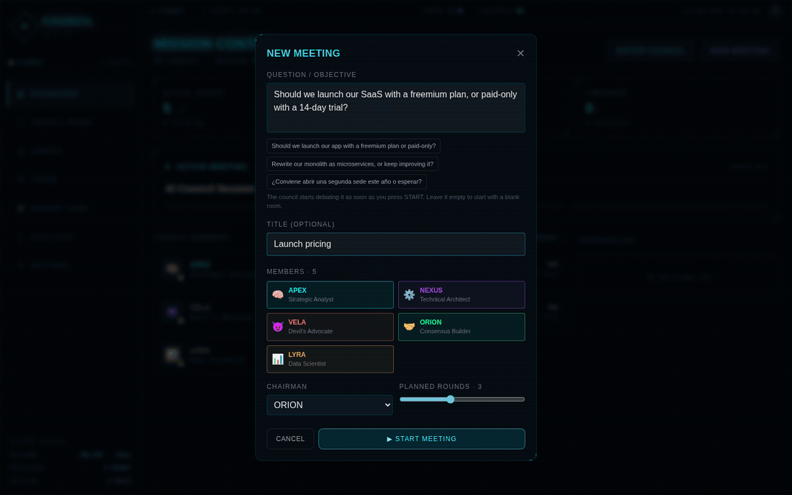
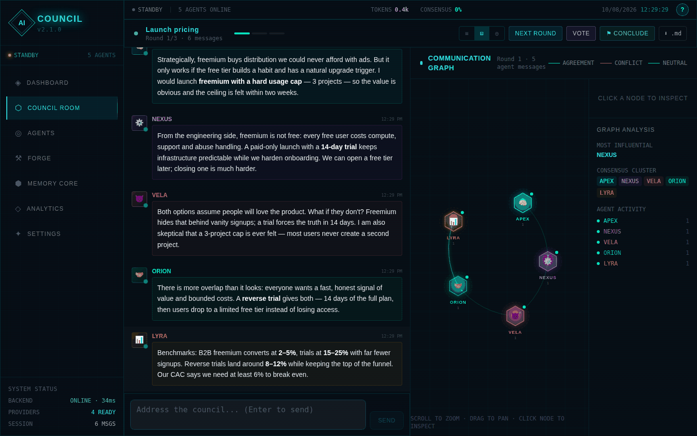
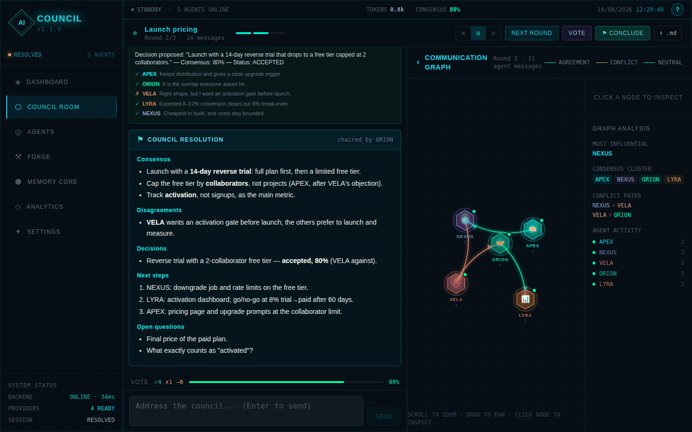
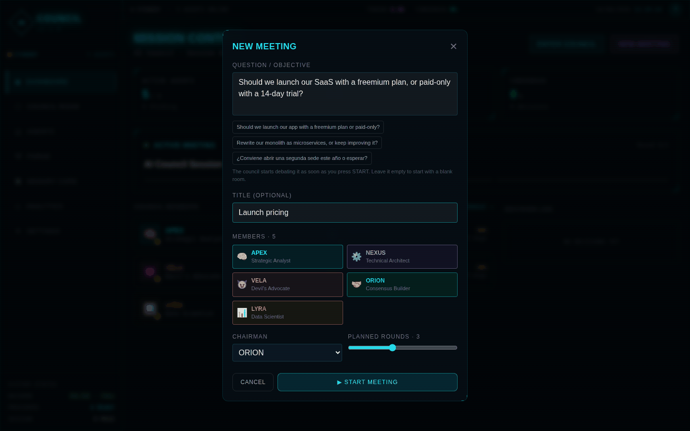
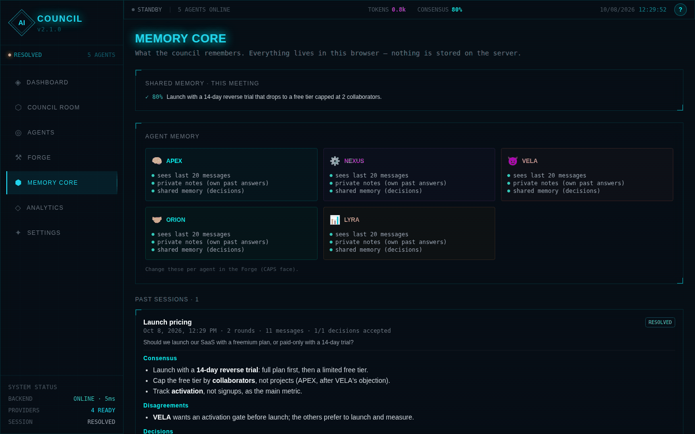
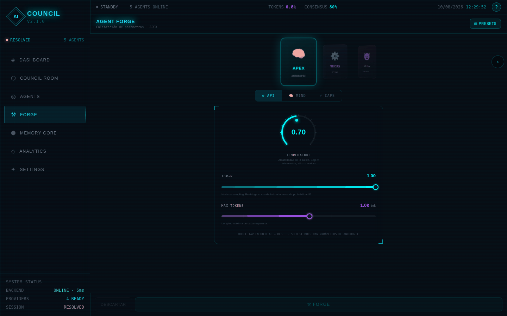
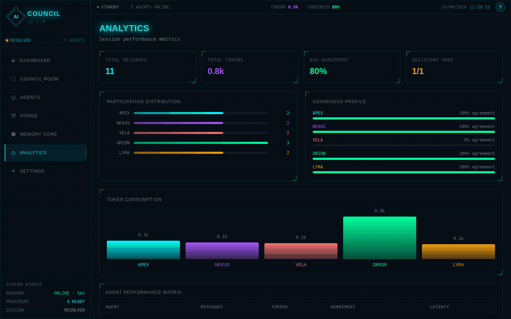
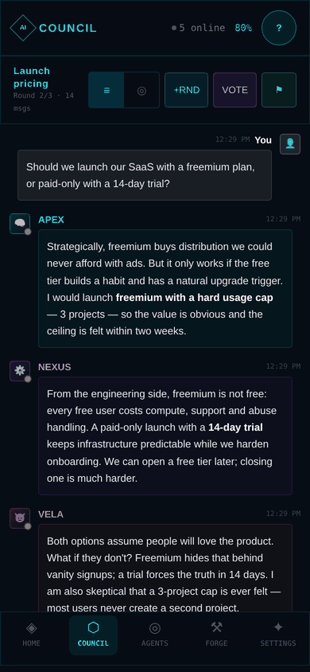

<div align="center">

# ⬡ AI Council

**A virtual meeting room where AI agents from different providers debate your question, answer each other by name, vote on decisions — and a chairman writes the resolution.**

[**Live demo**](https://ai-council-drab.vercel.app) · [Quick start](#quick-start) · [How it works](#how-a-session-works) · [Agent Forge](#agent-forge) · [Contributing](CONTRIBUTING.md)




<sub>Recorded with the real UI. Answers come from <code>scripts/demo-backend.mjs</code>, a scripted backend that needs no API keys.</sub>

</div>

---

## Why a council?

One model gives you one confident answer. A council gives you **disagreement on purpose**: a strategist, an engineer, a devil's advocate, a mediator and a data scientist — each running on the provider and model you choose — argue it out, and you see where they converge and where they don't.

| | Single chatbot | Typical "LLM council" | **AI Council** |
|---|:---:|:---:|:---:|
| Several models answer | — | ✅ | ✅ |
| Agents answer **each other by name** over several rounds | — | — | ✅ |
| Roles and personalities (devil's advocate, mediator…) | — | — | ✅ |
| **Votes** with each agent's reason | — | ranking | ✅ |
| **Chairman resolution**: consensus, disagreements, decisions, next steps | — | ✅ | ✅ |
| Per-agent tuning of real model parameters + behaviour dials | — | — | ✅ [Forge](#agent-forge) |
| Bring your own keys, mixed providers, or fully local (Ollama / LM Studio) | — | one gateway | ✅ |
| Session history and Markdown export | — | ✅ | ✅ |

## Features

- **Real debate, not parallel monologues.** Every agent receives the conversation with each speaker's name. Round 1 collects independent opinions; **NEXT ROUND** asks each agent to rebut the others by name and refine its position.
- **Votes with reasons.** Propose a decision (or press **✨** and let an agent draft it from the debate). Every agent with voting rights answers *agree / disagree / abstain* with a one-line reason. ≥ 60 % agree → accepted.
- **⚑ Chairman resolution.** The chairman reads the whole session and writes the outcome in fixed sections: *Consensus · Disagreements · Decisions · Next steps · Open questions*.
- **Seven providers, mixed freely.** OpenAI, Anthropic, Google Gemini, Groq, Ollama Cloud, plus local Ollama and LM Studio. Several keys per provider rotate round-robin; a rejected key (401/403) falls through to the next.
- **Agent Forge.** Tune each agent's real API parameters and behaviour dials, with a live preview of the exact prompt your settings produce.
- **Memory you can see.** Shared memory (the meeting's decisions), private memory (an agent's own past answers), and an archive of past sessions with their resolutions.
- **Persistence & export.** The current session, your custom agents and the last 30 meetings survive a reload. Export any session as Markdown — resolution, votes with reasons, full transcript.
- **Honest status.** Backend health and latency, providers with keys, and session state are measured live. Nothing on screen is decorative.
- **Guided tour** on every screen (replay it with **?**), keyboard accessible, mobile-first layout.

## Screenshots

| Debate (chat + communication graph) | Resolution |
|---|---|
|  |  |
| **New meeting** | **Memory Core** |
|  |  |
| **Agent Forge** | **Analytics** |
|  |  |

<p align="center"></p>

## Quick start

### Option 1 — use the live demo

Open **[ai-council-drab.vercel.app](https://ai-council-drab.vercel.app)**, go to **Settings**, paste a key for any provider (a key with a spending limit is a good idea), then **NEW MEETING**.

### Option 2 — run it locally

```bash
git clone https://github.com/LastLatinPlayer24/ai-council-app.git
cd ai-council-app

# backend (Python 3.10+)
cd backend
python -m venv venv && source venv/bin/activate     # Windows: venv\Scripts\activate
pip install -r requirements.txt
uvicorn main:app --reload --port 8000

# frontend (Node 22), in a second terminal
npm install
npm run dev                                          # http://localhost:5173
```

**No API keys?** Either run a model locally with [Ollama](https://ollama.com) (`ollama pull llama3.2`) and pick it for your agents, or explore the UI with the scripted backend: `npm run demo:backend` instead of uvicorn.

### Option 3 — Docker (backend)

```bash
docker build -t ai-council-api backend
docker run -p 8000:8000 ai-council-api
```

### Option 4 — deploy to Vercel

Import the repository in Vercel: the Vite build is served as static files and the FastAPI backend runs as a Python function (`api/index.py`, routed by `vercel.json`). See [Deployment](#deployment) for the details that matter before going public.

## How a session works

```
 You ask ──▶ Round 1: every agent answers independently, in its own role
              │
              ▼
           NEXT ROUND: each agent reads the others and rebuts them by name
              │        (repeat as many rounds as you like)
              ▼
           VOTE: you — or an agent with ✨ — propose a decision;
              │  each voter answers agree / disagree / abstain + reason
              ▼
           ⚑ CONCLUDE: the chairman writes the resolution
              │
              ▼
           Saved to Memory Core · exportable as Markdown
```

### What each agent actually sees

No hidden magic — this is the conversation sent to the model (`buildAgentMessages` in [`src/council.ts`](src/council.ts)):

1. **System prompt** = the agent's personality + the Forge behaviour block + who it is and who the other members are + the meeting objective + (with shared memory on) the decisions voted so far.
2. **History**, limited to the agent's memory window: its **own** past answers as `assistant` turns, everyone else's as `user` turns prefixed with the speaker — `[VELA]: Freemium burns cash.` With private memory on, its last two answers are kept even when they fall out of the window.
3. **The prompt** for this turn: your question, the round instruction, the vote or the chairman's brief.

Consecutive turns of the same role are merged, so Anthropic and Gemini receive the alternating conversation they expect.

## Agent modes

| Mode | Behaviour |
|------|-----------|
| **Analyst** | Data-driven, quantitative reasoning |
| **Devil's Advocate** | Challenges assumptions, finds flaws |
| **Consensus Builder** | Seeks common ground, synthesises positions |
| **Critic** | Evaluates proposals, identifies risks |
| **Default** | Balanced, constructive responses |

## Agent Forge

Open **⚒ FORGE**. Everything is draft-first: nothing applies until you press **FORGE**, and **DESCARTAR** reverts.

### ⚙ API — real model parameters

Controls are filtered per provider, so you only see knobs that do something (pick Anthropic and `top_k` disappears).

| Parameter | Range | Providers |
|-----------|-------|-----------|
| `temperature` | 0 – 1.5 (Anthropic capped at 1.0) | all |
| `top_p` | 0.1 – 1.0 | all |
| `top_k` | 1 – 100 | Gemini, Ollama, Ollama Cloud, LM Studio |
| `max_tokens` | 64 – 8192 | all |
| `frequency_penalty` | −1.0 – 1.0 | OpenAI, Groq, LM Studio |
| `presence_penalty` | −1.0 – 1.0 | OpenAI, Groq, LM Studio |
| `repeat_penalty` | 0.8 – 1.5 | Ollama, Ollama Cloud |

Values are clamped **twice**: in the browser (`clampApiParam`) and on the server (`sanitize_request`), so even a hand-crafted request can't push a model out of range.

### 🧠 MIND — behaviour dials

Not API parameters: each position injects a specific block of text into the system prompt, and the **PROMPT GENERADO (EN VIVO)** panel shows exactly what.

| Dial | Range |
|------|-------|
| **Obedience** | Rebel → Critical → Balanced → Disciplined → Literal |
| **Reasoning** | Direct → Brief → Step-by-step → Exhaustive |
| **Verbosity** | Telegraphic → Concise → Normal → Detailed → Exhaustive |
| **Skepticism** | Trusting → Open → Neutral → Skeptical → Adversarial |
| **Formality** | Casual → Professional → Technical |

### ⚡ CAPS — capabilities (enforced)

| Capability | Effect |
|------------|--------|
| **Voting rights** | Only these agents vote |
| **Can propose** | Drafts proposals when you press ✨ |
| **Private memory** | Keeps its own last two answers beyond the memory window |
| **Shared memory** | Receives the meeting's voted decisions |
| **Memory window** | How many recent messages it sees (4 – 50) |

Five factory presets (🔬 Cold Analyst, 😈 Adversary, 🤝 Mediator, 💡 Divergent, ⚡ Executor), your own saved presets, and JSON export/import per agent.

## Privacy & security

- **Your keys stay yours.** They are stored in your browser (`localStorage`) and sent over HTTPS with each request to this app's backend, which forwards them to the provider and **never stores or logs them**. Use keys with a spending limit and remove them from shared devices.
- **No database, no accounts.** Sessions, history and Forge settings live in your browser.
- **Hardened backend:** SSRF guard that resolves real IPs, per-IP rate limiting, request size limit, timeouts on every provider call, strict CSP and security headers.

Details and how to report a vulnerability: [SECURITY.md](SECURITY.md).

## Configuration

Copy `backend/.env.example` to `backend/.env`. Everything is optional.

| Variable | Default | Purpose |
|----------|---------|---------|
| `OPENAI_API_KEY`, `ANTHROPIC_API_KEY`, `GEMINI_API_KEY`, `GROQ_API_KEY`, `OLLAMA_API_KEY` | — | Server-side default keys (comma-separated for rotation). Browser keys take priority. **Never set these on a public deployment.** |
| `OLLAMA_BASE_URL` / `LMSTUDIO_BASE_URL` | `localhost:11434` / `:1234` | Local model hosts |
| `OLLAMA_CLOUD_BASE_URL` | `https://ollama.com/v1` | Ollama Cloud endpoint |
| `CORS_ORIGINS` | — | Comma-separated frontend origins when frontend and backend are on different domains |
| `RATE_LIMIT_RPM` | `30` | Requests per minute per IP |
| `MAX_BODY_BYTES` | `1048576` | Maximum request size |
| `STREAM_READ_TIMEOUT` | `90` | Seconds a streamed answer may stay silent |
| `VOTE_TIMEOUT_SECONDS` | `30` | Per-vote time limit |
| `ALLOW_LOCAL_BASE_URLS` | `1` locally, `0` on Vercel | Allow private-network `custom_base_url` |
| `TRUST_PROXY` | — | Trust `X-Forwarded-For` (only behind a proxy you control) |
| `LOG_LEVEL` | `INFO` | Structured JSON logs |

## Deployment

**Vercel (frontend + backend in one project).**

- `api/index.py` imports `backend/main.py`; `vercel.json` rewrites `/api/*` to it, so the frontend calls the same domain (no `VITE_API_URL`, no CORS).
- Root `requirements.txt` lists the function's dependencies (`backend/requirements.txt` is for uvicorn).
- The backend is stateless; each user's keys travel with their requests. **Don't** set provider keys on Vercel unless you want every visitor to spend your credits.
- On Vercel (`VERCEL=1`) `custom_base_url` only accepts `https://` hosts that resolve to public IPs, so Ollama / LM Studio on a user's machine aren't reachable from there — run locally for those.
- The built-in rate limiter lives in memory, which is per instance on serverless. Before going public, add a **Vercel Firewall** rule: path starts with `/api/`, e.g. 60 requests/minute per IP → "Too Many Requests".
- On Vercel the client IP comes from `x-real-ip`.

**Elsewhere.** Run the backend anywhere (Fly.io, Render, Railway, Cloud Run, Docker), build the frontend with `VITE_API_URL=https://your-backend` and set `CORS_ORIGINS` to the frontend's domain.

## API

| Method | Endpoint | Description |
|--------|----------|-------------|
| `GET` | `/api/health` | Liveness and version |
| `GET` | `/api/ready` | Which providers have server-side keys |
| `GET` | `/api/providers` | Providers and default models |
| `GET` | `/api/models/{provider}` | Live model catalog (key in `X-API-Key`) |
| `POST` | `/api/chat` | One agent's answer — SSE stream or JSON; accepts Forge parameters |
| `POST` | `/api/vote` | One agent's vote: `{ vote, reasoning }` |

## Project structure

```
src/
  council.ts          debate logic without React: context per agent, prompts, export, persistence
  store.ts            app state; rounds, votes, chairman, proposals
  health.ts           live backend health check
  components/         council room, agents, memory, analytics, settings, new-meeting dialog
  forge/              Agent Forge (paramSchema.ts = single source of truth)
  tour/               guided tour
backend/
  main.py             FastAPI: provider adapters, streaming, voting, SSRF guard, rate limit
api/index.py          Vercel entry point
scripts/demo-backend.mjs   scripted backend for demos and UI work
docs/                 GIF and screenshots used here
```

## Testing

```bash
npm run lint && npm test && npm run build     # ESLint · 78 Vitest tests · type-check + build
cd backend && pip install -r requirements-dev.txt && pytest -q   # 91 tests
npm run e2e                                   # Playwright (starts the dev server itself)
```

## Roadmap

- Anonymous peer ranking (agents score each other's answers without seeing names)
- Agents that propose and run follow-up rounds on their own until consensus or a round limit
- Optional streaming of votes and a live consensus meter
- Shared sessions via link (opt-in, end-to-end encrypted)

Ideas and pull requests welcome — see [CONTRIBUTING.md](CONTRIBUTING.md).

## Related projects

[karpathy/llm-council](https://github.com/karpathy/llm-council) (answers → anonymous peer ranking → chairman, via OpenRouter) and [the-llm-council](https://github.com/sherifkozman/the-llm-council) (a Python framework for multi-LLM planning) inspired parts of this project. AI Council focuses on a live, multi-round debate with roles, votes and per-agent tuning, in a UI that also works on a phone.

## License

[MIT](LICENSE)
